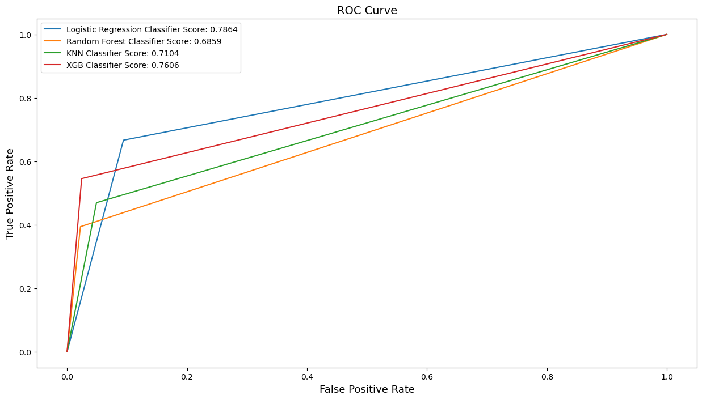

# bankruptcy-prediction

* Built a binary classification model to predict the probability of companies tending towards bankruptcy.
  * The data was collected from the Netherlands Economic Journal for the years 1999 to 2009.
  * Company bankruptcy was defined based on the business regulations of the Netherlands Stock Exchange

## EDA

* There are many non-bankrupt companies with 'Borrowing dependency' around 0.4.
 * Though it does not guarantee no-bankruptcy (some bankrupt companies are also present).However it seems having a lower or upper value impacts bankruptcy.
* There's a visible pattern that indicates companies with low value (<0.2) of 'Per Share Net profit before tax (Yuan �'/ 'Net profit before tax/Paid-in capital'/ 'Persistent EPS in the Last Four Seasons' tend to go bankrupt.
* Having 'Net Income to Stockholder's Equity' value around 0.8 may safeguard a company from bankruptcy.Though it does not guarantee it

## Models

* The Logistic Regression model has the highest "recall-score”
* This means the model is good at predicting companies tending towards Bankruptcy.
* However, this comes at a cost of low "precision-score" which means high number of false positives.

## Refer "Bankruptcy Prediction.pptx" for details.

